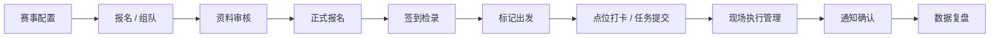
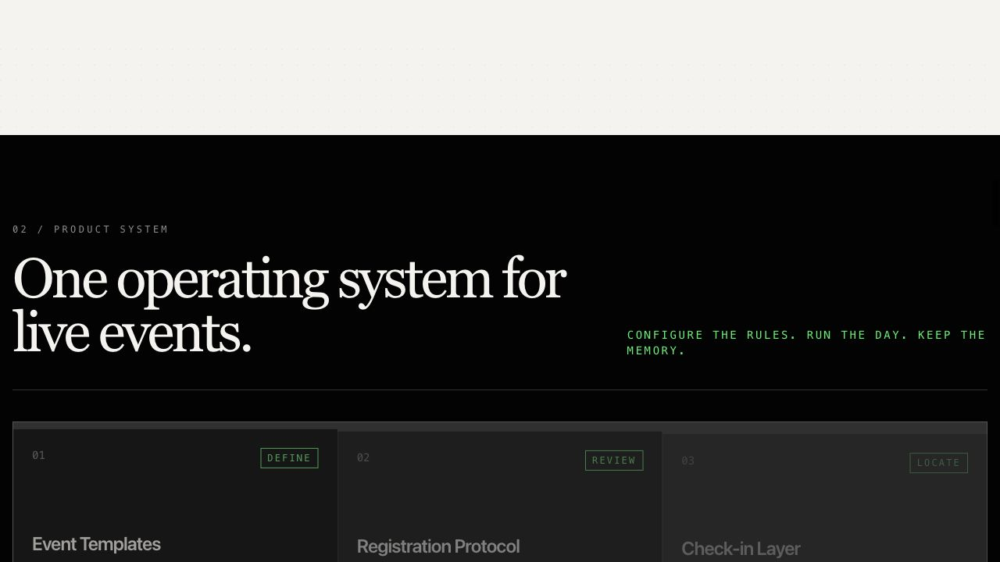
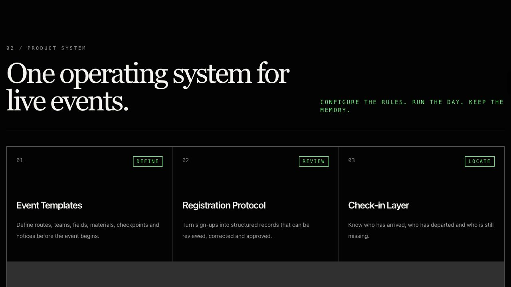
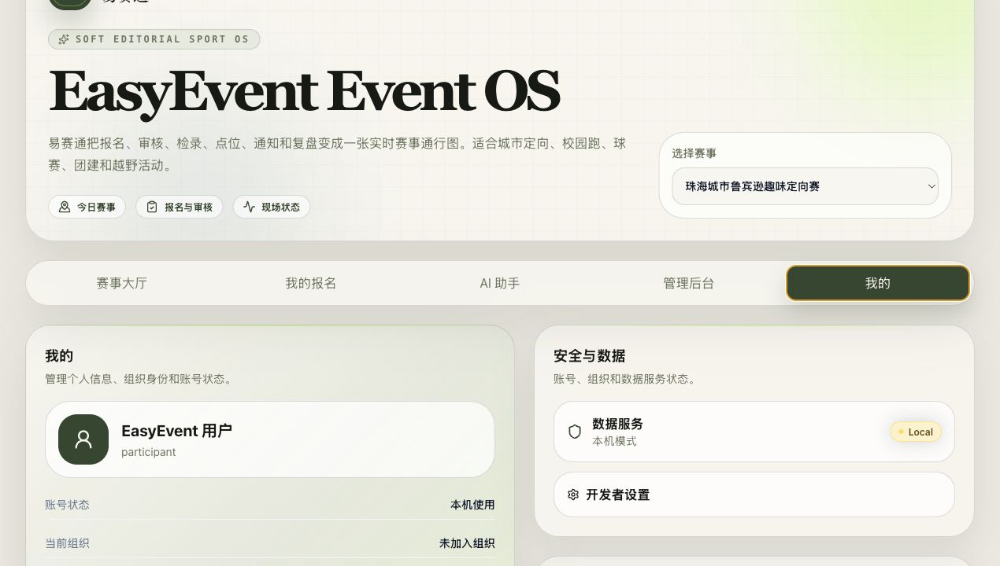
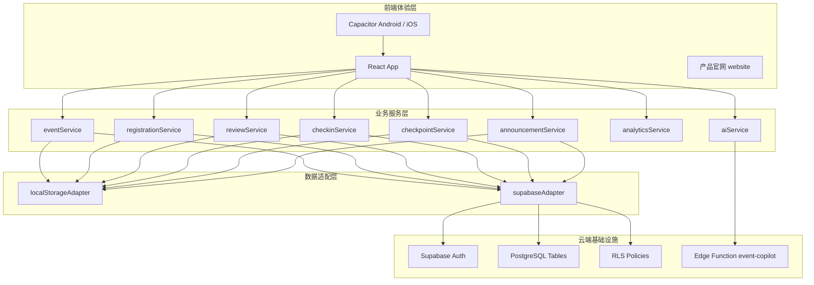
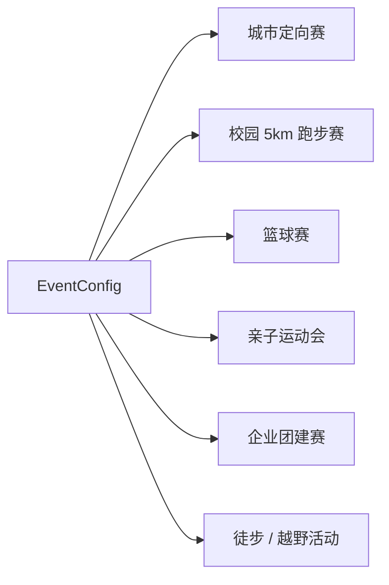

# EasyEvent / 易赛通 产品说明报告

生成日期：2026-06-18  
项目定位：面向中小型体育赛事的可复用赛事操作系统  
当前阶段：产品化 Alpha，已具备 App、官网、Supabase 后端最小闭环、Capacitor Android / iOS 封装和 APK 测试包

---

## 1. 一句话介绍

EasyEvent（易赛通）不是一个普通报名表，也不是一个单场赛事页面。它是一套面向城市定向赛、校园跑步赛、篮球赛、亲子运动会、企业团建赛、徒步 / 越野活动等场景的中小型体育赛事操作系统。

它把传统赛事中分散在微信群、问卷、Excel、纸质签到表和人工沟通中的流程，整合为一条可追踪、可审核、可复盘的数字化链路：



这意味着 EasyEvent 不只是展示 HTML 页面，而是已经具备真实软件的基本形态：有 App 端、有官网、有可配置赛事模型、有 service 层、有 Supabase 云端数据结构、有 Auth 登录注册、有 Android APK 产物，也有未来接入 AI、健康数据、文件上传、扫码和推送的架构边界。

---

## 2. 当前已经生成的核心成果

截至目前，项目已经形成两条主要产品线：

1. **EasyEvent App**
   - 面向参赛者和赛事组织方。
   - 覆盖报名、审核、签到、点位、通知、数据复盘等业务闭环。
   - 已通过 Capacitor 封装 Android / iOS 原生项目。
   - 已产出 Android Debug APK。

2. **EasyEvent 产品官网**
   - 面向外部用户、赛事组织者、潜在合作方。
   - 用于介绍产品定位、能力、适用赛事类型、下载入口和联系入口。
   - 已支持中英文切换。
   - 视觉风格从普通 landing page 升级为更高级的 editorial futurism / event operating system 叙事。

---

## 3. 产品官网

官网位于 `website/` 目录，是独立于主 App 的 Vite + React + TypeScript + Tailwind 项目。它不是简单的 HTML 静态页，而是一个独立产品官网工程，拥有自己的组件、内容配置、构建流程和发布配置。


### 3.1 官网定位

官网的核心任务不是承载业务流程，而是让别人第一眼理解 EasyEvent 是什么：

- 它是一个 sports event operating system。
- 它不是为珠海城市鲁宾逊一场赛事写死的。
- 它可以复用到多种中小型体育赛事。
- 它未来可以扩展到健康 / 可穿戴信号、AI 助手、桌面端和移动端分发。

### 3.2 官网信息结构

官网目前包含以下 section：

| Section | 作用 |
|---|---|
| Hero | 用一句高概念文案建立品牌第一印象 |
| Thesis | 解释为什么赛事不该继续依赖表格和群聊 |
| Product System | 说明 EasyEvent 的系统能力 |
| Templates | 展示多赛事模板复用能力 |
| Live Signals | 展示健康 / 手表 / GPS 信号的未来路线 |
| AI Assistant | 展示 AI 赛事助手未来路线与边界 |
| Download | 提供 Web、Android、iOS、Windows 下载 / 预约入口 |
| Contact | 提供联系表单和邮箱入口 |

### 3.3 官网视觉语言

官网参考了高端科技产品的视觉语言，但没有复制任何外部网站的素材、文案、图片或品牌元素。当前视觉特点包括：

- 大字号 serif 标题。
- 黑白 / 米白 / 酸性绿配色。
- 细线框、编号模块、留白和研究机构感。
- 抽象生成式赛事网络视觉。
- 短句式产品宣言，而不是普通 SaaS 功能堆砌。
- 中英文切换，兼顾品牌感和中文用户理解。



### 3.4 官网不是普通 HTML 的原因

官网虽然最终可以构建成静态页面，但开发方式不是手写普通 HTML：

- 使用 Vite 构建，具备现代前端工程能力。
- 使用 React 组件拆分页面结构。
- 使用 TypeScript 保证内容和组件类型清晰。
- 使用 Tailwind CSS 统一视觉系统。
- 主要文案集中在 `website/src/data/content.ts`，方便中英文维护和品牌迭代。
- 可通过 `npm run website:build` 生成可部署产物。
- 已准备 Netlify / Vercel / GitHub Pages 等静态部署说明。

### 3.5 下载与联系

下载区没有提供虚假安装链接，而是明确区分当前状态：

- Web App：组织测试入口。
- Android APK：Private beta build，需要申请访问。
- iOS TestFlight：邀请制测试。
- Windows Desktop：路线规划。



联系区使用前端表单和邮箱入口，当前邮箱为：

`1658684626@qq.com`

---

## 4. EasyEvent App

EasyEvent App 是主产品。它已经从课程原型转向产品化 Alpha，主信息架构从“项目概览 / 参赛者端 / 管理端 / 演示模式”调整为更接近真实软件的入口：

- 赛事大厅
- 我的报名
- AI 助手
- 管理后台
- 我的


### 4.1 App 当前能力总览

App 当前已经覆盖以下模块：

| 模块 | 当前能力 |
|---|---|
| 赛事大厅 | 查看当前可参与赛事、推荐赛事和下一步行动 |
| 我的报名 | 展示个人 / 队伍报名记录、报名状态、签到状态、通知状态 |
| 报名组队 | 支持个人报名和队伍报名 |
| 成员资料 | 根据 EventConfig 动态渲染成员字段和材料要求 |
| 规则校验 | 根据人数、字段、材料规则给出缺失项提示 |
| 管理审核 | 管理端可审核通过、驳回、确认为正式报名 |
| 签到检录 | 报名成功后生成签到码，管理端可完成签到和出发 |
| 点位任务 | 出发后可模拟到达点位并提交任务 |
| 现场执行 | 管理端查看赛中进度、审核点位任务、标记异常和完赛 |
| 通知公告 | 管理端发布通知，参赛者确认已读 |
| 数据复盘 | 汇总报名、审核、签到、点位、通知确认等运营指标 |
| AI 助手 Alpha | 提供赛事问答、报名状态解释、通知草稿和复盘摘要方向 |
| 我的 | 展示账户、组织、版本和开发者设置入口 |

### 4.2 我的报名与 Event Pass

“我的报名”不再是普通表格，而是使用 EventPassCard 的电子参赛证视觉，强调参赛者在赛事中的当前状态：

- 赛事名称。
- 队伍或个人报名名称。
- 项目 / 路线。
- 报名状态。
- 签到状态。
- 下一步行动。
- 通知提醒。


### 4.3 管理后台

管理后台采用 Soft Command Center 风格，不再像普通 Excel 后台。它把赛事组织方最关心的五个工作台放在一起：

- 报名审核。
- 签到检录。
- 现场执行。
- 通知公告。
- 数据复盘。


### 4.4 AI 助手 Alpha

App 中已经加入 AI 助手入口。它不是装饰性的聊天框，而是为后续接入真实 AI 服务准备了完整的产品入口和服务层：

- PixelCopilot 视觉组件。
- 对话气泡。
- 文本输入。
- 快捷问题。
- VoiceOrb 语音入口 UI。
- Supabase Edge Function 调用路径。
- OpenAI key 不出现在前端。


当前 AI 助手的边界非常明确：

- 不直接修改数据库。
- 不直接审核通过。
- 不直接驳回报名。
- 不直接删除数据。
- 不直接发布紧急通知。
- 不提供医疗建议。
- 关键操作只生成建议，必须人工确认。

### 4.5 我的页面

“我的”页面用于承载用户信息、组织信息、版本信息、退出登录和开发者设置等内容。开发相关内容被收进开发者设置，不再出现在普通用户首页。



---

## 5. 为什么它已经不只是普通 HTML

EasyEvent 当前已经具备真实软件的多层结构，而不是一个只靠 HTML 展示的页面。



### 5.1 React + TypeScript 组件化

App 和官网都不是单个 HTML 文件，而是由多个 React 组件组成。业务页面、通用 UI、状态标签、电子参赛证、AI 助手、数据卡片等都拆成组件，方便继续维护和扩展。

### 5.2 service 层抽离

项目已经新增 `src/services/`，页面不直接关心底层数据来自哪里。页面调用 service，service 再调用 adapter：

- 当前开发 fallback：`localStorageAdapter`
- 云端产品模式：`supabaseAdapter`

这让 EasyEvent 具备从本地演示数据迁移到真实后端的能力。

当前服务层文件包括：

```text
src/services/
  adapters/
    localStorageAdapter.ts
    supabaseAdapter.ts
    supabaseTransforms.ts
    types.ts
  aiService.ts
  analyticsService.ts
  announcementService.ts
  authService.ts
  checkinService.ts
  checkpointService.ts
  eventService.ts
  registrationService.ts
  reviewService.ts
  serviceClient.ts
```

### 5.3 Adapter 机制

EasyEvent 支持两种数据模式：

| 数据模式 | 用途 |
|---|---|
| Supabase adapter | 真实产品 Alpha，支持 Auth、云端赛事、云端报名、审核等 |
| localStorage adapter | 本地开发、离线预览、无后端 fallback |

这与普通 HTML 的最大区别是：页面不是一次性静态内容，而是通过统一服务接口读写状态，未来可以替换数据源。

---

## 6. Supabase 后端最小闭环

EasyEvent 已经接入 Supabase 基础设施，并完成第一版数据库 schema、RLS 策略、Auth 服务和 Supabase adapter。

### 6.1 Supabase 已覆盖的核心能力

当前 Supabase 模式覆盖：

- 用户注册 / 登录。
- Profile 创建和读取。
- 组织 organization。
- 赛事 events。
- 赛事项目 event_projects。
- 点位 event_checkpoints。
- 报名 registrations。
- 成员 registration_members。
- 审核日志 audit_logs。
- 点位进度 checkpoint_progress。
- 通知 announcements。
- 通知确认 announcement_confirmations。
- AI 对话 ai_conversations。
- AI 消息 ai_messages。

### 6.2 数据库表结构

`db/schema.sql` 当前包含以下表：

| 表名 | 作用 |
|---|---|
| organizations | 组织 / 主办方 |
| profiles | 用户资料，关联 Supabase Auth 用户 |
| events | 赛事主表 |
| event_projects | 赛事项目 / 路线 |
| event_checkpoints | 赛事点位 |
| registrations | 报名主表 |
| registration_members | 报名成员 |
| audit_logs | 审核、签到、点位、异常等操作日志 |
| checkpoint_progress | 点位任务进度 |
| announcements | 通知公告 |
| announcement_confirmations | 通知已读确认 |
| ai_conversations | AI 对话会话 |
| ai_messages | AI 消息 |

### 6.3 RLS 行级权限

Supabase 不是简单地让前端随意读写数据库。项目已经准备 `db/rls-policies.sql`，用于限制不同用户可以访问的数据：

- 普通用户只能读取和更新自己的 profile。
- 普通用户只能创建和读取自己的报名。
- 普通用户只能修改 draft / incomplete 状态的报名。
- reviewer / event_admin / org_admin 可以审核报名。
- checkin_staff / field_staff 可以处理签到和现场执行数据。
- AI 对话只允许用户读取自己的会话。
- 普通用户不能直接读取其他人的报名、AI 对话或管理数据。

### 6.4 Auth 登录注册

项目新增：

- `src/lib/supabaseClient.ts`
- `src/services/authService.ts`
- `src/pages/auth/AuthGate.tsx`
- `src/pages/auth/AuthPage.tsx`

Supabase 模式下必须登录后进入 App；localStorage 模式可以用于本地开发预览。

### 6.5 Supabase adapter

`supabaseAdapter.ts` 已实现：

- 读取赛事列表。
- 读取当前赛事。
- 读取报名列表。
- 创建报名。
- 更新报名。
- 删除报名。
- 审核通过。
- 驳回报名。
- 确认为正式报名。
- 写入 audit logs。
- 签到检录。
- 标记出发。
- 点位到达 / 提交 / 审核。
- 通知公告读取 / 发布 / 确认。

这说明 EasyEvent 已经不是单纯 localStorage 页面，而是具备云端数据闭环的产品 Alpha。

---

## 7. 赛事模板与 EventConfig

EasyEvent 的核心设计是：不把某个赛事写死到页面里。

珠海城市鲁宾逊趣味定向赛只是第一个模板。系统通过 EventConfig 支持不同赛事配置：

- 赛事名称。
- 赛事时间。
- 赛事地点。
- 报名模式：个人 / 队伍。
- 项目 / 路线。
- 队伍人数规则。
- 成员字段。
- 材料规则。
- 审核规则。
- 签到方式。
- 点位列表。
- 通知类型。
- 数据复盘指标。



这就是 EasyEvent 可以复用的基础。

---

## 8. 参赛者端能力

参赛者端已经支持从报名到完赛的完整体验。

### 8.1 报名与成员资料

参赛者可以：

- 选择赛事。
- 选择项目 / 路线。
- 创建个人报名或队伍报名。
- 填写队伍名称、队长、成员信息。
- 根据 EventConfig 动态填写字段。
- 填写材料文件名或材料占位信息。
- 查看缺失项提示。
- 提交审核。

### 8.2 状态跟踪

参赛者可以看到：

- 草稿中。
- 待完善。
- 待审核。
- 审核驳回。
- 审核通过。
- 报名成功。
- 未签到。
- 已签到。
- 已出发。
- 进行中。
- 异常关注。
- 已完赛。

### 8.3 签到码

报名成功后，系统会生成稳定的签到码。当前不做真实二维码，但已经具备“检录码”逻辑：

- 签到码根据 registration id 稳定生成。
- 管理端可输入签到码完成检录。
- 刷新后状态保持。

### 8.4 点位任务

出发后，参赛者可以进入点位打卡页面：

- 查看当前项目 / 路线对应点位。
- 模拟到达点位。
- 按任务类型提交任务。
- 查看任务是否已提交、通过。
- 查看完赛状态。

---

## 9. 管理端能力

管理端是赛事组织方的运营工作台。

### 9.1 报名审核

管理端可以：

- 查看当前赛事报名列表。
- 筛选待审核、待完善、驳回、通过、报名成功等状态。
- 查看报名详情。
- 查看成员资料。
- 查看材料要求。
- 查看系统缺失项。
- 审核通过。
- 驳回并填写原因。
- 确认为正式报名。
- 查看 auditLogs。

### 9.2 签到检录

管理端可以：

- 查看报名成功名单。
- 输入签到码或报名编号。
- 完成签到。
- 标记出发。
- 查看未签到、已签到、已出发数量。

### 9.3 现场执行

管理端可以：

- 查看已出发队伍。
- 查看点位进度。
- 审核 submitted 点位任务。
- 标记异常关注。
- 解除异常关注。
- 所有必需点位通过后标记完赛。

### 9.4 通知公告

管理端可以：

- 创建通知草稿。
- 发布通知。
- 按全部报名、项目 / 路线、报名状态定向通知。
- 查看应确认、已确认、未确认和确认率。
- 查看已确认和未确认名单。

### 9.5 数据复盘

管理端可以查看：

- 总报名数。
- 审核通过情况。
- 正式报名数。
- 签到率。
- 出发率。
- 完赛率。
- 异常关注数量。
- 项目 / 路线表现。
- 点位任务积压。
- 通知确认率。
- 自动运营洞察。

---

## 10. AI 助手 Alpha

EasyEvent 已经预留并实现 AI 助手 Alpha 的完整入口。

### 10.1 前端能力

AI 页面包括：

- PixelCopilot 像素助手。
- 对话气泡。
- 快捷问题。
- 文字输入框。
- VoiceOrb 语音按钮 UI。

### 10.2 服务层

新增：

- `src/services/aiService.ts`
- `src/pages/assistant/AiAssistantPage.tsx`
- `supabase/functions/event-copilot/index.ts`

### 10.3 安全设计

AI 的关键边界：

- 前端不暴露 OpenAI API Key。
- OpenAI key 只放在 Supabase Edge Function 环境变量中。
- AI 不直接修改数据库。
- AI 不直接审批、驳回、删除或发布紧急通知。
- AI 不提供医疗建议。
- 关键操作必须人工确认。

### 10.4 未来可以做什么

后续接入真实 AI 后，可以实现：

- 解释报名状态。
- 告诉参赛者还缺什么资料。
- 告诉参赛者下一步是什么。
- 帮管理员总结待审核情况。
- 生成通知草稿。
- 生成赛后复盘摘要。

---

## 11. Capacitor App 化与 Android APK

EasyEvent 已经接入 Capacitor，不只是 Web 页面。

### 11.1 Capacitor 配置

当前配置：

```ts
appId: 'com.easyevent.app'
appName: 'EasyEvent'
webDir: 'dist'
```

项目已经包含：

- `capacitor.config.ts`
- `android/`
- `ios/`
- App icon / splash 资源。

### 11.2 Android SDK / JDK / APK

当前机器已经安装：

- JDK 21。
- Android command-line tools。
- Android SDK Platform 36。
- Android Build Tools 36。
- Android Platform Tools。

已经成功生成 Debug APK：

```text
dist/EasyEvent-alpha-debug.apk
android/app/build/outputs/apk/debug/app-debug.apk
```

APK 大小约 6.2 MB，SHA-256：

```text
18b5adb5714dc3f2365a468001460fc10ffe4dc2db5b9aa2b9f94a64be662dff
```

### 11.3 Debug APK 与正式发布区别

当前 APK 是 Debug 测试包：

- 可以安装到 Android 手机测试。
- 适合内部测试。
- 不适合正式分发。
- 正式分发需要 release 签名。
- 上架 Google Play 需要 AAB、签名、隐私政策和应用商店资料。

---

## 12. 当前文件与目录成果

### 12.1 主 App

```text
src/
  app/
  components/
  pages/
    auth/
    assistant/
    participant/
    admin/
    profile/
  services/
  utils/
  types/
  data/
```

### 12.2 官网

```text
website/
  package.json
  index.html
  src/
    App.tsx
    components/
    data/content.ts
    index.css
```

### 12.3 后端与发布

```text
db/
  schema.sql
  rls-policies.sql
  seed.sql

supabase/
  functions/
    event-copilot/
      index.ts

android/
ios/
assets/
docs/
```

---

## 13. 当前仍未实现的部分

为了避免误导，下面这些能力目前还没有真正接入：

| 能力 | 当前状态 |
|---|---|
| 支付 | 未实现 |
| 真实文件上传 | 未实现，后续可接 Supabase Storage |
| 真实扫码 | 未实现，当前保留输入签到码 |
| 真实地图 / GPS | 未实现 |
| 推送通知 | 未实现 |
| 健康 / 手表数据 | 未实现，只做产品路线和 UI 占位 |
| App Store / Google Play 上架 | 未完成 |
| 正式 release 签名 APK | 未完成 |
| Windows 桌面版 | 未实现 |

这些不是当前项目缺陷，而是产品边界。当前阶段目标是 Alpha：先完成真实 App 结构、云端数据基础、Android 测试包和可展示官网。

---

## 14. 与普通课程 Demo 的差异

EasyEvent 当前已经明显超过普通课程 Demo：

| 普通 Demo | EasyEvent 当前状态 |
|---|---|
| 静态 HTML 页面 | React + TypeScript + Vite 工程 |
| 页面里写死数据 | EventConfig + service + adapter |
| 只展示表单 | 覆盖报名、审核、签到、点位、通知、复盘 |
| 没有后端设计 | Supabase schema + RLS + Auth + adapter |
| 没有 App 包 | Capacitor Android / iOS + APK |
| 没有官网 | 独立产品官网 website |
| 没有发布路线 | Android APK、TestFlight、官网部署文档 |
| 没有 AI 规划 | AI Assistant Alpha + Edge Function |
| 没有权限边界 | RLS 策略和角色设计 |

---

## 15. 下一步建议

### 15.1 短期

1. 在 Supabase 中完成测试账号邮箱确认。
2. 跑通注册 / 登录 / 创建报名 / 审核的云端闭环。
3. 用 Android 手机安装 `EasyEvent-alpha-debug.apk` 进行真机测试。
4. 把官网部署到 Netlify 或 Vercel，生成公网产品页。
5. 准备一个 release 签名配置，生成可分发 APK。

### 15.2 中期

1. Supabase Storage：实现真实材料上传。
2. Camera / Barcode：实现真实扫码检录。
3. Push：实现通知推送。
4. Edge Function：完善 AI 助手真实上下文。
5. RLS 压测：验证不同角色的读写边界。

### 15.3 长期

1. Android signed APK / AAB 内测。
2. iOS TestFlight。
3. 多组织 / 多赛事商业化管理。
4. 健康 / 可穿戴信号接入。
5. 赛事模板市场。
6. 运营复盘报告自动生成。

---

## 16. 总结

EasyEvent / 易赛通目前已经形成一个比较完整的产品雏形：

- 有能说明产品价值的官网。
- 有可运行的 App。
- 有参赛者端和管理端。
- 有 Supabase 云端后端最小闭环。
- 有 Auth 登录注册基础。
- 有 service / adapter 架构。
- 有 Android / iOS 原生项目。
- 有已生成的 Android APK。
- 有 AI 助手 Alpha 入口。
- 有未来真实产品化路线。

它已经不是单纯的网页或课程静态页面，而是一个可以继续推进到真实内测、真实用户、真实赛事现场的体育赛事管理 App Alpha。

