# EasyEvent 易赛通：面向中小型体育赛事的一站式数字化管理 App 设计与实现

**副标题：以珠海城市鲁宾逊趣味定向赛为例的报名、审核、签到、现场执行、通知确认与数据复盘解决方案**

课程作业：赛事运营数字化解决方案  
作业类型：期末个人作业  
学生姓名：___  
日期：2026 年 6 月  
关键词：体育赛事管理、数字化运营、赛事模板、签到检录、现场执行、数据复盘、AI 助手、Supabase 后端、Capacitor App

---

## 2. 摘要

本报告围绕中小型体育赛事运营中的数字化转型问题展开，选取珠海城市鲁宾逊趣味定向赛作为首个代表性场景，针对报名、审核、签到、现场执行、通知确认与赛后复盘割裂的问题，提出 EasyEvent / 易赛通一站式赛事数字化管理 App 设计方案。传统赛事运营往往依赖问卷、微信群、Excel、纸质签到表和人工沟通，虽然可以完成局部任务，但缺少统一状态系统，导致组织方难以及时掌握参赛者从报名到完赛的全过程。

EasyEvent 的核心设计不是建立一个单场赛事页面，也不是简单将报名表搬到线上，而是通过 EventConfig / 赛事模板机制，将赛事规则、报名模式、成员字段、材料要求、签到方式、点位任务、通知类型和复盘指标配置化，从而复用到城市定向赛、校园跑步赛、篮球赛、亲子运动会、企业团建、徒步越野和社区运动会等不同场景。

本项目已经超过课程作业“无需实质产品开发”的要求，进一步完成了可运行 Web App MVP、Capacitor Android / iOS App 化基础、独立产品官网、Supabase 后端接入方案与数据库 schema / RLS、Auth 登录注册基础、AI 助手 Alpha 与 Edge Function 路径，以及 Android APK 构建脚本。方案最终价值在于减少人工核对、提升现场执行可视性、降低漏审和漏通知风险，并将赛后数据沉淀为下一届赛事优化依据。

---

## 3. 赛事背景与问题洞察

珠海城市鲁宾逊趣味定向赛属于开放空间、多人组队、路线点位型体育赛事。与固定场馆内的单项比赛不同，城市定向赛通常涉及多个路线、多个点位、多支队伍和不同任务类型。参赛者并非全部集中在同一场地，而是在城市空间中分散移动，这使得组织方必须同时处理报名审核、现场签到、出发管理、点位进度、任务提交、通知触达和赛后复盘。

这类赛事具有以下特征：

1. 参赛者通常以队伍为单位报名，而不是单人报名。
2. 赛事可能包含多路线、多项目或不同组别。
3. 参赛人群可能包括学生、校友、亲子家庭、社会人士等。
4. 报名阶段需要校验人数、成员身份、材料、路线规则和未成年人信息。
5. 赛中队伍分散移动，点位进度不容易被集中掌握。
6. 现场有签到、出发、点位任务、异常关注、通知确认和复盘需求。

传统赛事运营往往依赖以下工具：

- 问卷：收集报名信息。
- 微信群：发布通知和临时沟通。
- Excel：整理名单和统计数据。
- 纸质签到表：完成现场检录。
- 电话 / 对讲：处理突发情况。
- 人工汇总：赛后统计报名、签到和完赛情况。

这些工具并不是完全无效，但它们之间相互割裂。问卷不知道谁已经签到，签到表不知道谁已经出发，微信群不知道谁已经确认通知，Excel 也无法自动形成实时现场状态。因此，本报告形成一个核心判断：

> 赛事不是一次性报名表，而是一个从赛前组织、赛中执行到赛后复盘的连续运营系统。

---

## 4. 具体痛点定义

本方案聚焦四个关键痛点，而不是泛泛而谈“赛事需要数字化”。

### 4.1 痛点一：报名与审核规则复杂，人工核对成本高

城市定向赛和团队类赛事通常涉及队伍人数、队长信息、成员身份、材料证明、路线选择和特殊人群信息。传统方式下，这些规则依赖工作人员在问卷和 Excel 中逐项核验，容易出现漏审、错审和重复沟通。

### 4.2 痛点二：签到与现场执行割裂

报名名单和现场签到常常不在一套系统中。工作人员需要翻找名单、手工勾选、再回传统计结果，导致现场查找慢、状态更新滞后，也难以及时区分“已报名但未签到”“已签到但未出发”“已出发但未完成任务”的队伍。

### 4.3 痛点三：开放空间赛事赛中不可视

城市定向赛中，队伍在多个点位之间移动。负责人很难实时知道每支队伍当前处于哪个点位、是否已经提交任务、是否长时间停留、是否需要异常关注。现场状态依赖人工汇报，信息延迟高。

### 4.4 痛点四：通知触达与赛后复盘困难

微信群可以发送消息，但无法精确确认谁已读、谁未读。赛后数据则分散在问卷、Excel、纸质表、群聊和工作人员记忆中，难以沉淀为下一届赛事优化依据。

| 痛点 | 传统方式 | 运营风险 | EasyEvent 的解决思路 |
|---|---|---|---|
| 报名审核复杂 | 问卷 + Excel 人工核验 | 漏审、错审、反复沟通 | EventConfig 规则校验 + 管理端审核 |
| 签到与名单割裂 | 纸质签到表 | 状态滞后、查找慢 | 签到码检录 + 状态同步 |
| 赛中不可视 | 电话 / 群聊反馈 | 异常发现慢 | 点位状态流 + 现场执行工作台 |
| 通知与复盘困难 | 微信群 + 人工汇总 | 漏通知、难复盘 | 通知确认 + 数据复盘 |

---

## 5. 解决方案总览

EasyEvent 易赛通是一套面向中小型体育赛事的一站式数字化管理 App。它通过赛事模板配置，将报名组队、资料审核、签到检录、点位打卡、通知确认和数据复盘整合到统一平台。

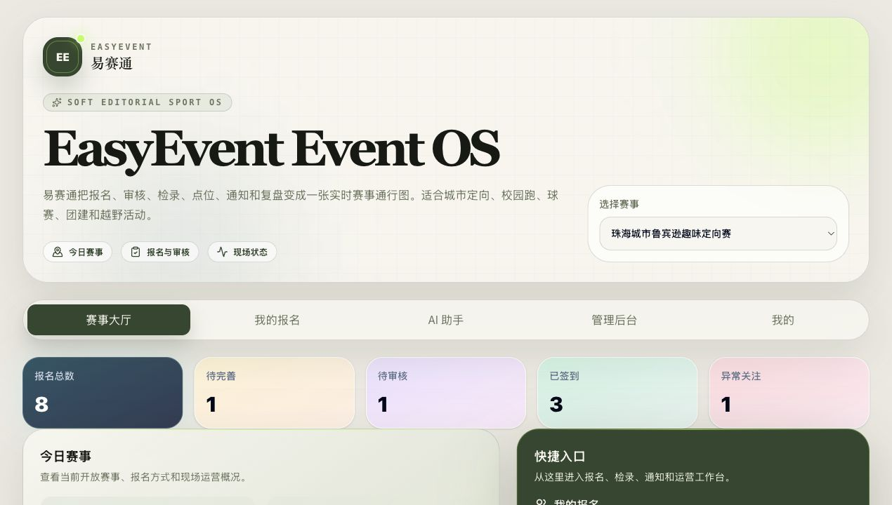

端到端闭环如下：

系统由五个部分组成：

1. **参赛者端**：报名、查看状态、签到码、点位任务、通知确认、AI 问答。
2. **管理端**：审核、签到检录、现场执行、通知公告、数据复盘。
3. **AI 助手**：解释状态、提示缺失项、生成通知草稿和复盘摘要。
4. **产品官网**：介绍产品、展示能力、提供下载与联系入口。
5. **后端服务**：Supabase Auth、PostgreSQL、RLS、Edge Function 和 localStorage fallback。

---

## 6. 产品定位与目标用户

EasyEvent 的产品定位是：

> 面向中小型体育赛事的可复用赛事操作系统 / 一站式赛事管理 App。

它的目标用户包括：

| 用户角色 | 核心需求 | EasyEvent 对应能力 |
|---|---|---|
| 参赛者 | 报名、查看状态、签到、通知确认 | 赛事大厅、我的报名、签到码、通知中心 |
| 队长 | 创建队伍、填写成员资料、提交审核 | 队伍报名、成员编辑、状态跟踪 |
| 赛事管理员 | 配置赛事、审核资料、查看运营状态 | 管理后台、审核工作台、数据复盘 |
| 检录员 | 快速确认到场和出发 | 签到检录、标记出发 |
| 现场执行人员 | 查看点位进度、处理异常 | 现场执行、点位审核、异常关注 |
| 组织方 / 主办方 | 复盘赛事、优化下一届 | 数据看板、运营洞察、复盘摘要 |

---

## 7. 核心业务闭环设计

### 7.1 报名审核闭环

该闭环解决了报名表只收集数据、不能执行规则的问题。系统会根据 EventConfig 自动判断人数、字段和材料是否满足要求，管理端再进行人工确认。

### 7.2 签到检录闭环

签到状态不再停留在纸质表中，而是进入统一数据流。

### 7.3 现场执行闭环

### 7.4 通知确认闭环

### 7.5 数据复盘闭环

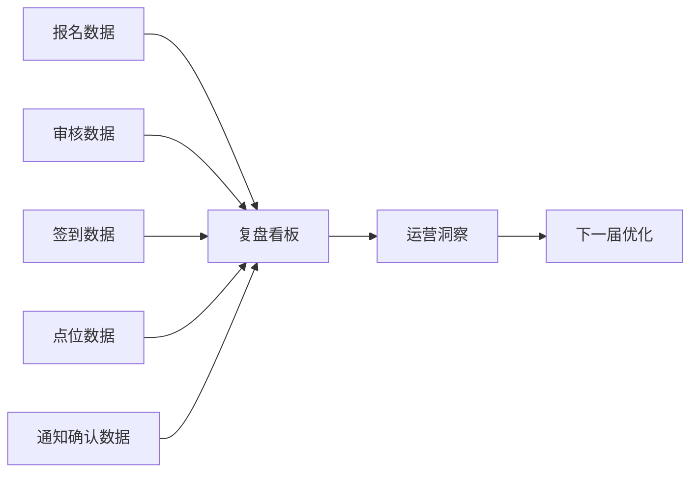

---

## 8. 系统功能模块设计

| 模块 | 用户 | 功能 | 对应痛点 | 实现状态 |
|---|---|---|---|---|
| 赛事模板配置 | 管理员 | 配置报名模式、路线、字段、材料、点位、通知类型 | 不同赛事规则不同 | 已实现 MVP |
| 参赛者报名 / 组队 | 参赛者、队长 | 创建个人 / 队伍报名，填写成员资料 | 报名信息分散 | 已实现 MVP |
| 规则校验 | 参赛者、审核员 | 自动提示人数、字段、材料缺失 | 人工核验成本高 | 已实现 MVP |
| 管理端审核 | 审核员 | 通过、驳回、确认为正式报名 | 漏审、错审 | 已实现 MVP，Supabase adapter 支持 |
| 签到检录 | 检录员 | 签到码、检录、标记出发 | 纸质签到滞后 | 已实现 MVP，云端 adapter 已扩展 |
| 点位打卡 / 任务提交 | 参赛者、现场人员 | 到达、提交、审核、完赛 | 现场不可视 | 已实现 MVP，云端 adapter 已扩展 |
| 现场执行管理 | 现场人员 | 队伍进度、异常关注、完赛 | 异常发现慢 | 已实现 MVP |
| 通知公告 / 已读确认 | 管理员、参赛者 | 定向通知、确认率、未确认名单 | 群消息不可追踪 | 已实现 MVP，云端 adapter 已扩展 |
| 数据复盘 | 主办方 | 指标卡、漏斗、项目表现、运营洞察 | 赛后难复盘 | 已实现 MVP |
| AI 助手 Alpha | 参赛者、管理员 | 状态解释、草稿生成、复盘摘要 | 信息理解成本高 | Alpha，Edge Function 路径已完成 |
| 产品官网 | 外部用户 | 产品介绍、下载、联系 | 对外表达不足 | 已实现 |
| App 化与下载准备 | 测试用户 | Android / iOS 原生工程、APK 脚本 | 难以安装体验 | 已实现 Android Debug APK |

---

## 9. 关键页面与交互设计

### 9.1 产品官网首页

页面作用：展示 EasyEvent 的品牌定位、产品叙事和外部传播能力。  
解决的问题：让组织方理解 EasyEvent 不是单场赛事工具，而是可复用赛事操作系统。  
设计亮点：中英文切换、极简大标题、下载和联系入口。

### 9.2 App 首页 / 赛事大厅

页面作用：用户打开 App 后直接看到赛事和下一步行动。  
解决的问题：避免首页变成开发说明页，让 App 更像真实可用软件。  
设计亮点：赛事卡片、下一步行动、AI 助手入口。

### 9.3 我的报名 / EventPassCard

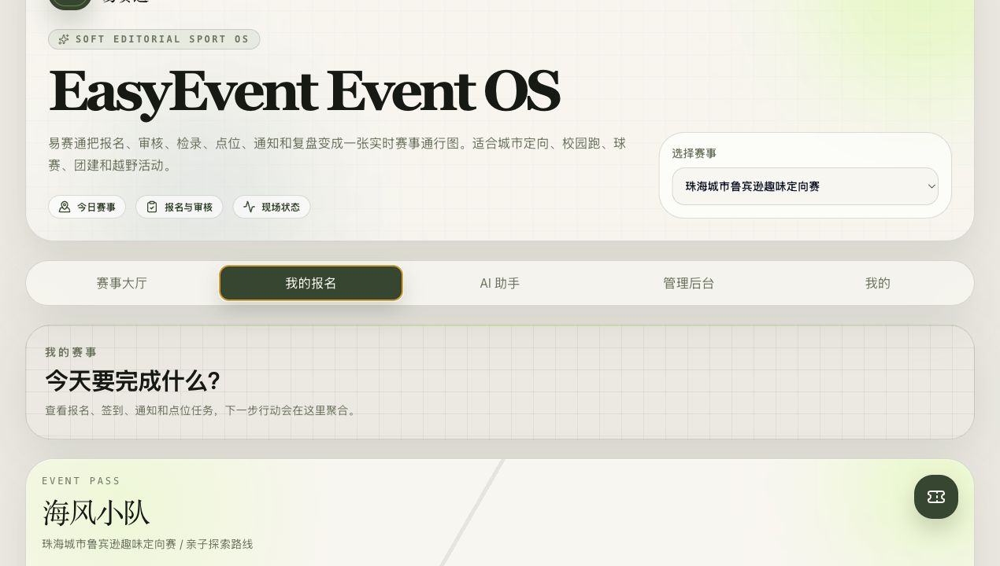

页面作用：展示报名状态、签到状态和下一步行动。  
解决的问题：参赛者不需要理解后台流程，也能知道自己该做什么。  
设计亮点：电子参赛证、状态标签、通知提醒。

### 9.4 管理后台

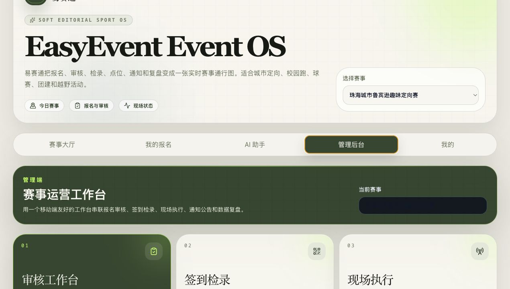

页面作用：集中展示审核、签到、现场执行、通知和复盘入口。  
解决的问题：组织方不再在多个工具之间切换。  
设计亮点：模块化命令中心、状态数字和操作入口。

### 9.5 签到检录

页面作用：管理端可以输入签到码或从列表点击完成检录。  
解决的问题：替代纸质签到表和人工统计。  
设计亮点：签到码、已签到、已出发状态进入同一数据流。

### 9.6 点位打卡与现场执行

页面作用：展示开放空间赛事中的点位进度和任务审核。  
解决的问题：队伍分散移动时，组织方难以掌握实时状态。  
设计亮点：点位状态流、待审核任务、异常关注。

### 9.7 通知公告

页面作用：发布定向通知并统计确认情况。  
解决的问题：微信群通知无法确认谁已读。  
设计亮点：按项目 / 状态定向、确认率、未确认名单。

### 9.8 数据复盘

页面作用：汇总报名、审核、签到、点位和通知确认数据。  
解决的问题：赛后不再依赖人工整理 Excel。  
设计亮点：指标卡、项目表现、点位积压和运营洞察。

### 9.9 AI 助手

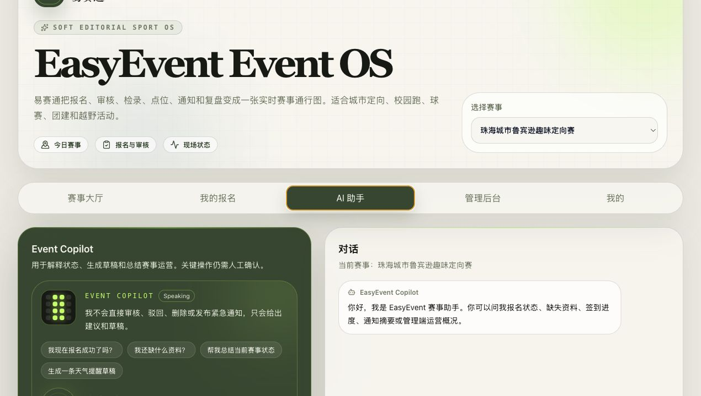

页面作用：为参赛者和管理员提供状态解释、通知草稿和复盘摘要入口。  
解决的问题：降低用户理解流程和管理端整理信息的成本。  
设计亮点：PixelCopilot、快捷问题、语音入口 UI、安全边界。

---

## 10. 数据结构与状态流设计

EasyEvent 的专业性体现在状态流和数据结构上。系统把“工作人员脑中的流程”变成可计算、可追踪、可复盘的数据状态。

### 10.1 状态流

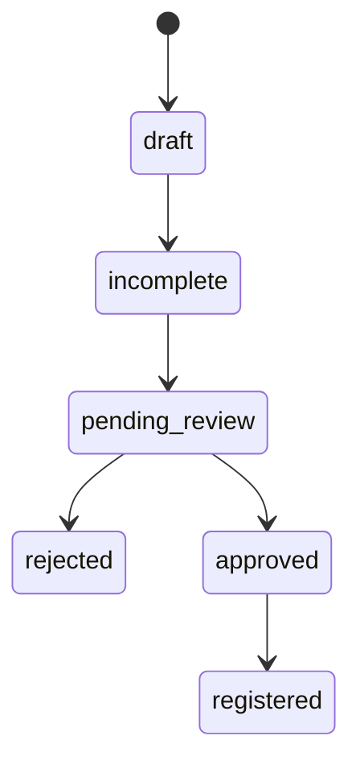

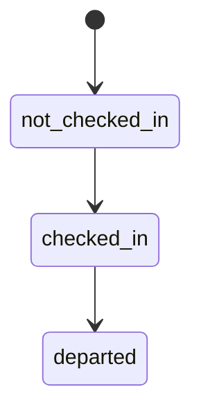

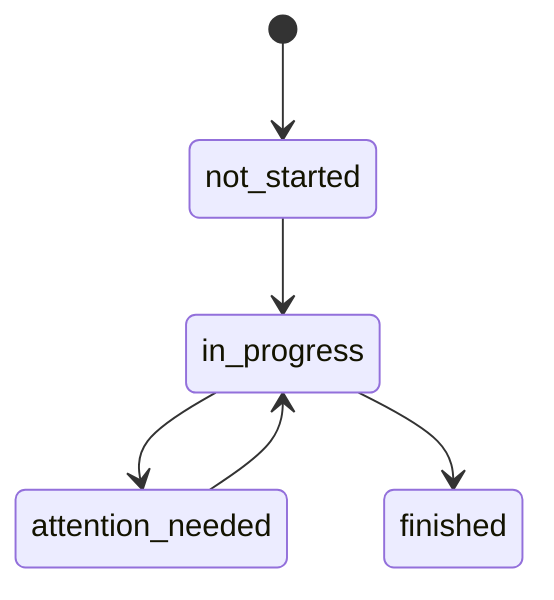

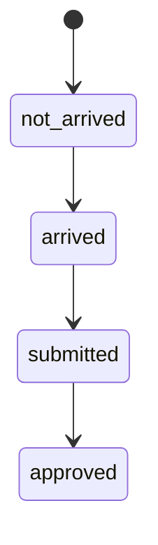

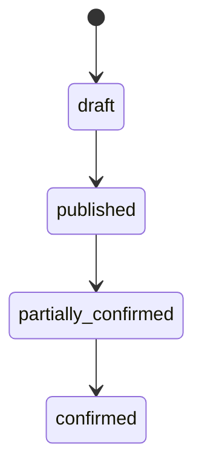

### 10.2 关键数据实体

| 实体 | 作用 |
|---|---|
| EventConfig | 赛事模板配置 |
| EventProject | 项目 / 路线 |
| Registration | 报名记录 |
| Member | 报名成员 |
| AuditLog | 审核与操作日志 |
| CheckpointProgress | 点位任务进度 |
| Announcement | 通知公告 |
| AnnouncementConfirmation | 已读确认 |
| AI Conversation / AI Message | AI 对话 |

### 10.3 数据关系图

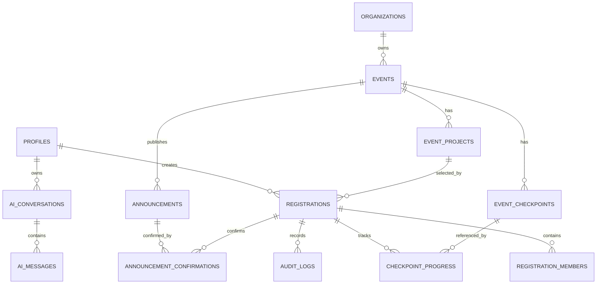

---

## 11. 技术架构与可行性

EasyEvent 的技术方案强调可落地，而不是停留在概念层。

### 11.1 技术栈

前端：

- React
- TypeScript
- Vite
- Tailwind CSS
- motion
- lucide-react

App 化：

- Capacitor
- Android / iOS 原生项目
- App icon / splash
- Android APK 构建脚本

后端：

- Supabase
- PostgreSQL
- Row Level Security
- Auth
- Edge Functions

数据：

- Supabase 云端模式。
- localStorage fallback。
- Service layer。
- Adapter pattern。

### 11.2 分层架构

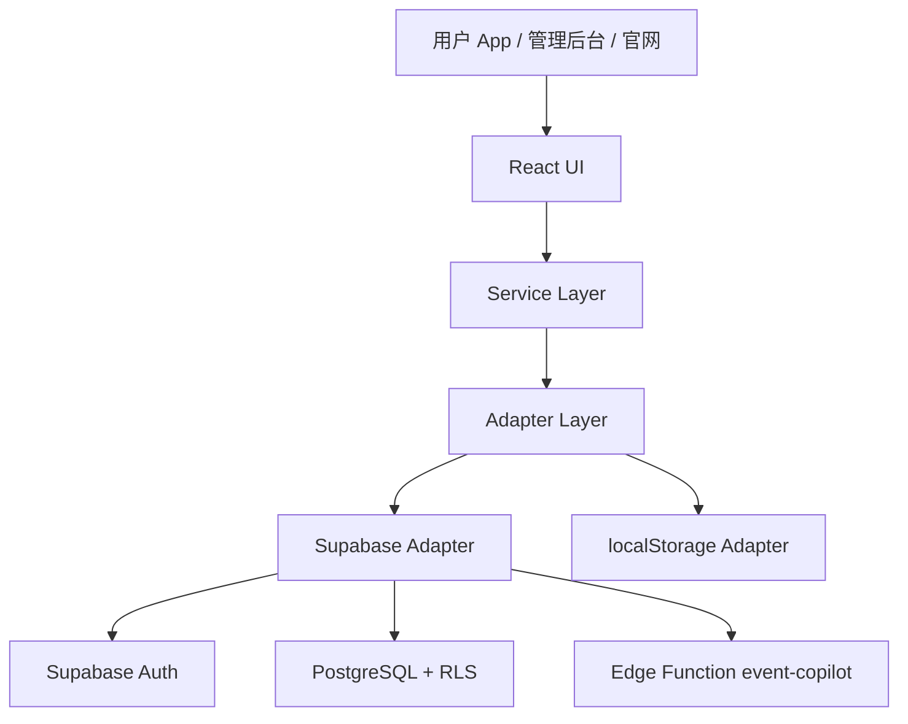

关键原则：

1. 页面不直接调用 Supabase。
2. 页面通过 service 层访问业务能力。
3. service 层通过 adapter 切换数据源。
4. localStorage 仅作为本地开发和 fallback。
5. Supabase 是真实产品数据模式。
6. RLS 控制不同角色的数据权限。

### 11.3 Supabase schema 与权限

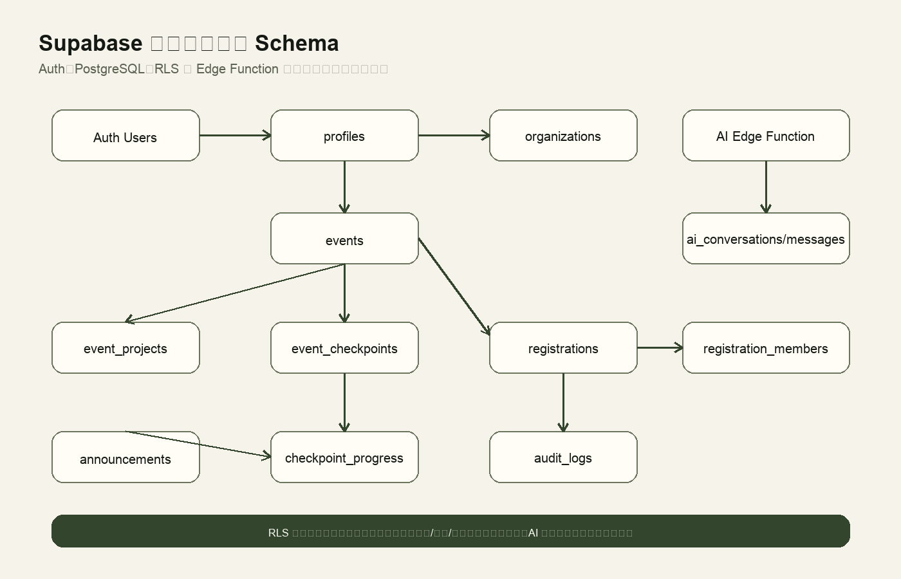

已设计和接入的表包括 organizations、profiles、events、event_projects、event_checkpoints、registrations、registration_members、audit_logs、checkpoint_progress、announcements、announcement_confirmations、ai_conversations 和 ai_messages。

RLS 权限覆盖：

- 参赛者只读写自己的报名。
- 审核员和管理员处理审核。
- 检录员处理签到。
- 现场人员处理点位和异常。
- AI 对话只归属当前用户。

---

## 12. 真实后端与 App 化实现成果

### 从产品设计到可运行软件：超过课程要求的实现成果

虽然作业要求“无需进行实质产品开发”，但 EasyEvent 已进一步完成从产品设计到真实 App Alpha 的工程化推进。

| 能力 | 普通产品设计作业 | EasyEvent 当前完成度 |
|---|---|---|
| 原型设计 | 有 | 有 |
| 可运行 Demo | 不一定 | 已完成 Web App MVP |
| 真实 App 化 | 通常无 | Capacitor Android / iOS 已接入 |
| 后端数据库 | 通常无 | Supabase schema / RLS 已完成 |
| 登录能力 | 通常无 | Auth 登录 / 注册基础已完成 |
| AI 助手 | 通常无 | Edge Function Alpha |
| APK 产出 | 通常无 | Android Debug APK 已生成 |
| 产品官网 | 通常无 | 独立官网已完成 |

### 12.1 App 化成果

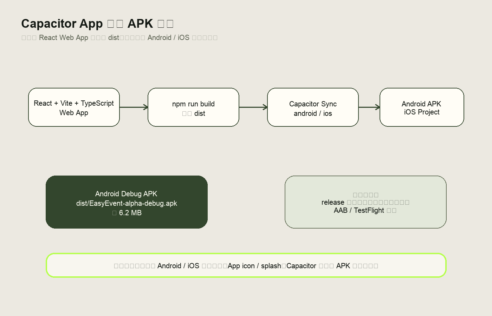

当前已完成：

- `capacitor.config.ts`
- Android 原生工程 `android/`
- iOS 原生工程 `ios/`
- App ID：`com.easyevent.app`
- App Name：`EasyEvent`
- Android Debug APK：`dist/EasyEvent-alpha-debug.apk`

### 12.2 后端成果

当前已具备：

- Supabase client 初始化。
- Auth 登录 / 注册。
- profiles 初始化。
- events / registrations / reviews 的云端 adapter。
- checkin / checkpoints / announcements 云端 adapter 扩展。
- schema / RLS / seed SQL。
- 云端 Alpha 测试文档。

### 12.3 AI 成果

当前已具备：

- AI 助手前端页面。
- `aiService.ts`。
- Supabase Edge Function：`event-copilot`。
- OPENAI_API_KEY 服务端配置路径。
- 不在前端暴露 AI key。
- AI 操作安全边界。

---

## 13. 方案创新点

1. **可配置赛事模板，而不是单场赛事写死**  
   EventConfig 使 EasyEvent 能够适配不同赛事，而不是只服务珠海城市鲁宾逊趣味定向赛。

2. **从报名工具升级为赛事操作系统**  
   系统覆盖报名、审核、签到、点位、通知和复盘，而不是只做报名收集。

3. **状态流驱动运营**  
   报名状态、签到状态、点位状态和通知状态共同构成可追踪流程。

4. **现场执行可视化**  
   点位任务、异常关注、出发和完赛状态让开放空间赛事更可控。

5. **通知确认网络**  
   不是只发送通知，而是确认谁已读、谁未读。

6. **AI 助手与健康 / 手表信号路线**  
   AI 助手用于解释状态、生成草稿和总结复盘；未来可接健康和可穿戴信号，但坚持隐私和人工确认边界。

7. **真后端 + App 化**  
   项目已经从课程方案推进到可运行 App Alpha，具备真实落地潜力。

---

## 14. 可复制性与跨赛事扩展

EasyEvent 不只适合鲁滨逊赛事。系统通过 EventConfig 支持以下配置项：

- 赛事名称。
- 时间地点。
- 报名模式：个人 / 队伍。
- 项目 / 路线。
- 人数规则。
- 成员字段。
- 材料规则。
- 签到方式。
- 点位任务。
- 通知类型。
- 复盘指标。

| 赛事类型 | 报名模式 | 关键规则 | 现场执行 | EasyEvent 复用方式 |
|---|---|---|---|---|
| 城市定向赛 | 队伍 | 路线、人数、点位任务 | 多点位移动 | 配置路线、点位、任务 |
| 校园跑步赛 | 个人 | 组别、检录、完赛 | 起终点检录 | 配置项目组别和签到 |
| 篮球赛 | 队伍 | 队员名单、资格审核 | 场次检录 | 配置队伍字段和材料 |
| 亲子运动会 | 家庭 / 队伍 | 年龄、监护人 | 项目任务 | 配置成员关系和规则 |
| 企业团建 | 队伍 | 部门、任务积分 | 任务点执行 | 配置任务和贡献记录 |
| 徒步越野 | 个人 / 队伍 | 路段、安全关注 | 阶段打卡 | 配置路段和异常关注 |
| 社区运动会 | 个人 / 队伍 | 年龄组、社区组 | 项目检录 | 配置组别和通知 |

---

## 15. AI 助手、健康数据与未来联动

### 15.1 AI 助手 Alpha

当前 AI 助手已具备 Alpha 形态：

- 状态解释。
- 缺失项提醒。
- 通知草稿。
- 复盘摘要。
- 管理建议。

边界：

- 不自动审核。
- 不自动删除。
- 不自动发布紧急通知。
- 关键操作人工确认。
- 不提供医疗建议。

### 15.2 健康 / 手表联动 Roadmap

未来可接入：

- Apple Health / HealthKit。
- Android Health Connect。
- Apple Watch。
- Wear OS。
- Fitbit。
- Garmin。
- Samsung Health。

可能能力：

- 步数。
- 心率提示。
- 活动状态。
- 长时间无活动提醒。
- 队伍运动贡献。
- 安全关注信号。

隐私边界：

- 用户授权。
- 最小化读取。
- 默认不向队友公开原始健康数据。
- 赛事方只看到必要运营信号。
- 不做医疗诊断。

---

## 16. 效益评估与数字化价值

| 维度 | 传统方式 | EasyEvent 方式 | 价值 |
|---|---|---|---|
| 报名 | 问卷 + Excel | App 报名 + 云端数据 | 减少重复整理 |
| 审核 | 人工逐项检查 | 系统缺失项 + 管理端审核 | 降低漏审 |
| 签到 | 纸质名单 | 签到码检录 | 提升现场效率 |
| 点位 | 群聊反馈 | 点位状态流 | 提升现场可视性 |
| 通知 | 微信群 | 通知确认率 | 降低漏通知 |
| 复盘 | 赛后人工汇总 | 数据看板 | 沉淀经验 |
| 跨赛事复用 | 每场重新搭工具 | EventConfig 模板 | 降低下一场赛事配置成本 |

整体价值可以概括为：

1. 减少人工核对。
2. 提高现场执行可视性。
3. 降低漏审和漏通知。
4. 提升参赛者状态透明度。
5. 为下一届赛事沉淀运营数据。

---

## 17. 风险、边界与后续计划

### 17.1 当前边界

1. 支付未接入。
2. 文件上传仍需 Supabase Storage 完整接入。
3. 真实扫码还需移动端相机权限。
4. 地图 / GPS 未接入。
5. 推送通知未接入。
6. 健康数据未接入。
7. AI 助手仍是 Alpha。

### 17.2 主要风险

1. 数据隐私和身份材料保护。
2. RLS 权限策略配置错误。
3. 现场网络不稳定。
4. 移动端兼容问题。
5. 健康数据敏感。
6. AI 输出需要人工确认。
7. App 签名和上架审核。

### 17.3 后续计划

| 阶段 | 目标 |
|---|---|
| Phase 1 | 真实 Supabase 云端闭环验收 |
| Phase 2 | Android debug APK / signed APK |
| Phase 3 | 文件上传与扫码检录 |
| Phase 4 | iOS TestFlight |
| Phase 5 | 通知推送 |
| Phase 6 | 健康 / 手表联动 |
| Phase 7 | AI 助手增强 |
| Phase 8 | 多组织 / 多赛事 SaaS 化 |

---

## 18. 结论

EasyEvent / 易赛通从珠海城市鲁宾逊趣味定向赛这一具体赛事场景出发，识别出中小型体育赛事在报名、审核、签到、现场执行、通知确认和赛后复盘之间的割裂问题，并提出一套端到端的一站式数字化解决方案。

本方案没有停留在单一报名表，而是覆盖赛前、赛中、赛后的完整运营闭环；没有把珠海赛事写死，而是通过 EventConfig / 赛事模板支持跨赛事复用；没有停留在概念层，而是进一步完成了可运行 App MVP、产品官网、Supabase 后端接入、AI 助手 Alpha、Capacitor App 化和 Android APK 构建脚本。

EasyEvent 的价值不只是把报名表搬到线上，而是把赛事运营从分散工具中的人工协作，转变为可配置、可执行、可确认、可复盘的数字化系统。

---

## 19. 附录：页面截图清单 / 技术实现清单

### 19.1 页面截图清单

详细截图清单见：[final-report-screenshot-checklist.md](./final-report-screenshot-checklist.md)。

### 19.2 技术实现清单

| 类型 | 文件 / 目录 | 说明 |
|---|---|---|
| App 入口 | `src/app/App.tsx` | 真实 App 信息架构 |
| Auth | `src/pages/auth/`、`src/services/authService.ts` | 登录、注册、profile |
| AI | `src/pages/assistant/`、`src/services/aiService.ts` | AI 助手 Alpha |
| 服务层 | `src/services/` | 业务 API 抽离 |
| Adapter | `src/services/adapters/` | localStorage / Supabase 数据源 |
| 数据库 | `db/schema.sql` | Supabase 表结构 |
| 权限 | `db/rls-policies.sql` | RLS 策略 |
| 初始化 | `db/seed.sql` | 示例赛事数据 |
| Edge Function | `supabase/functions/event-copilot/index.ts` | AI 服务端入口 |
| 官网 | `website/` | 独立产品官网 |
| App 化 | `capacitor.config.ts`、`android/`、`ios/` | Android / iOS 工程 |
| APK | `dist/EasyEvent-alpha-debug.apk` | Android Debug 测试包 |

